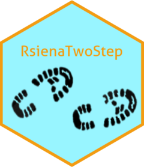
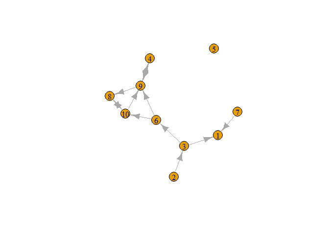
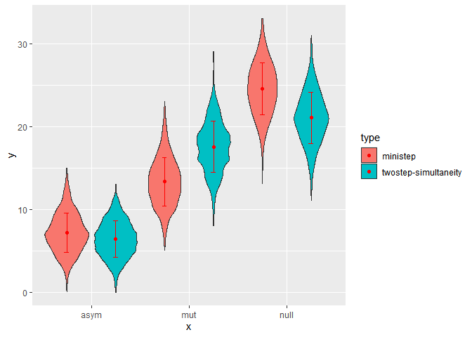

<!-- README.md is generated from README.Rmd. Please edit that file -->

<a href="https://jochemtolsma.github.io/RsienaTwoStep/"></a>

<br> <br> <br> <br> <br>

For detailed instructions how to use the package, please see the
[package website](https://jochemtolsma.github.io/RsienaTwoStep/).

------------------------------------------------------------------------

# GOAL

The goal of `RsienaTwoStep` is to provide a method to asses the extent
to which results obtained by `RSiena::siena07` depend on the validity of
the ministep assumption.

A crucial assumption of the SAOM as implemented in RSiena is the
‘ministep’: only one actor at the time is allowed to make one
tie-change. This package aims to provide a method to asses the extent to
which results obtained by RSiena hinge on this crucial ministep
assumption. It does so by simulating the evolution of networks by
allowing two actors to make decisions on tie-changes simultaneously.

Depending on the precise implementation of the two-step procedure,
allowing for twosteps can be interpreted simply as:  
- allowing for **simultaneity**: when two actors are picked at random to
simultaneously make a ministep;  
- allowing for ***weak* coordination**: two actors are picked at random
to simultaneously make a ministep but only specific possible future
networks are regarded as the result of coordination and included in the
choice set of the two actors;  
- allowing for ***strict* coordination**: only actors are sampled to
make a twostep who are connected at time1.

The package can mix the ratio of ministeps and twosteps.

## Installation

You can install the development version of RsienaTwoStep from
[GitHub](https://github.com/) with:

``` r
# install.packages("devtools")
devtools::install_github("JochemTolsma/RsienaTwoStep", build_vignettes=TRUE)
```

## Vignettes

Make sure to check out the vignettes:

``` r
browseVignettes("RsienaTwoStep")
```

------------------------------------------------------------------------

# Examples

ABM-ministep and ABM-twostep simulations on toy data

``` r
library(RsienaTwoStep)
#> Loading required package: foreach
```

## our network

``` r
net1g <- igraph::graph_from_adjacency_matrix(net1, mode="directed")
plot(net1g)
```



``` r
unloadNamespace("igraph") # to avoid clashes with package `sna`. 
```

## setting up cluster

This is of course not necessary but will make the simulations a lot
faster.

``` r
library(doParallel)
#> Loading required package: iterators
#> Loading required package: parallel
#stopCluster(my.cluster) 
n.cores <- parallel::detectCores() - 1  #save one core for other work
# create the cluster
my.cluster <- parallel::makeCluster(n.cores, type = "PSOCK")
# register it to be used by %dopar%
doParallel::registerDoParallel(cl = my.cluster)
```

## Degree and reciprocity

Let us assume people really don’t like to have a non-reciprocal tie but
do like reciprocal ties a lot. (I only want to help you if you help me!)

Thus if you start with a network without many (reciprocal) ties it would
be very difficult to get more reciprocal ties in the normal ministep
model. However, with simultaneity this should be possible.

### simulate networks for two conditions

``` r
sims1 <- f_sims(nsims=1000, parallel=TRUE, net=net1, rate=10, statistics=list(f_degree, f_recip), parameters=c(-1,2), p2step=0, chain=FALSE) #ministep only

sims2 <- f_sims(nsims=1000, parallel=TRUE, net=net1, rate=10, statistics=list(f_degree, f_recip), parameters=c(-1,2), p2step=1, chain=FALSE) #twostep-simultaneity
```

### counting dyads

``` r
df_s1 <- f_dyads(sims=sims1, simtype="ministep") 
df_s2 <- f_dyads(sims=sims2, simtype="twostep-simultaneity") 
```

### plot results of the three dyadcensus

``` r
library(ggplot2)
#> Warning: package 'ggplot2' was built under R version 4.2.2

## combine datasets
df <- rbind(df_s1, df_s2)

p <- ggplot(df, aes(x=x, y=y, fill=type)) + 
  geom_violin(position=position_dodge(1)) + 
  stat_summary(fun = mean,
               geom = "errorbar",
               fun.max = function(x) mean(x) + sd(x),
               fun.min = function(x) mean(x) - sd(x),
               width=.1,
               color="red", position=position_dodge(1)) + 
  stat_summary(fun = mean,
               geom = "point",
               color="red", position=position_dodge(1)) 
  
p
```



# Conclusion

1.  The dyad count shows the two type of simulations lead to a different
    dyad-count.  
2.  If two actors are allowed to change their ties simultaneously, this
    will lead to more reciprocal ties than when actors have to make a
    tie-change one after each other.

<!--- 

What is special about using `README.Rmd` instead of just `README.md`? You can include R chunks like so:


```r
summary(cars)
#>      speed           dist       
#>  Min.   : 4.0   Min.   :  2.00  
#>  1st Qu.:12.0   1st Qu.: 26.00  
#>  Median :15.0   Median : 36.00  
#>  Mean   :15.4   Mean   : 42.98  
#>  3rd Qu.:19.0   3rd Qu.: 56.00  
#>  Max.   :25.0   Max.   :120.00
```

You'll still need to render `README.Rmd` regularly, to keep `README.md` up-to-date. `devtools::build_readme()` is handy for this. You could also use GitHub Actions to re-render `README.Rmd` every time you push. An example workflow can be found here: <https://github.com/r-lib/actions/tree/v1/examples>.

You can also embed plots, for example:


In that case, don't forget to commit and push the resulting figure files, so they display on GitHub and CRAN.

-->
